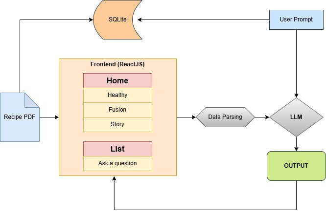

# Cooksmith — AI-Powered Recipe Transformer

Cooksmith is a creative document processing app that ingests PDF recipes, parses and transforms them using LLM workflows, and presents outputs in a beautiful React + Tailwind interface.

---



---
## Features

-  Extract and parse recipe PDFs
-  Transform recipes: Healthy | Fusion | Fairytale
-  Ask questions about recipes using structured data
-  Beautiful UI with animations, visual background, and side-by-side panels
-  SQLite database for transformation & Q&A history

---

## Project Structure

```
Cooksmith/
├── agents/
│   ├── llm_client.py
│   ├── parser.py
│   ├── router_agent.py
│   └── utils.py
│
├── backend/
│   ├── cooksmith.db
│   ├── cooksmith_api.py
│   ├── db.py
│   ├── explore_db.py
│   ├── requirements.txt
│   └── app.py
│
├── cooksmith-frontend/
│   ├── public/
│   ├── src/
│   ├── package.json
│   ├── package-lock.json
│   ├── tailwind.config.js
│   └── tsconfig.json
│
├── data/
│   ├── recipes_data.zip
│   └── .gitignore
│
├── cooksmith_diag.jpg
├── README.md
└── requirements.txt

```

---

##  Setup Instructions

### 1. Backend Setup

```bash
cd backend
python -m venv venv
source venv/bin/activate
pip install -r ../requirements.txt
uvicorn cooksmith_api:app --reload --port 8000
```

### 2. Frontend Setup

```bash
cd cooksmith-frontend
npm install
npm start
```

### Optional: Add Recipe ZIP
Place your `recipes_data.zip` in the `data/` folder. Run the CLI app to extract and process:

```bash
python run_app.py
```

---

## How It Works

### LLM Workflow (Router Agent)

```text
1. Upload recipe → Extracted via PDF parser
2. User selects transformation goal:
   - Healthy → Optimized by nutritionist agent
   - Fusion → Mixed with global cuisine agent
   - Story → Narrativized into a fairytale
3. Output saved to history & displayed in UI
```

### Structured Q&A

- Recipes are parsed into structured JSON
- Users can ask natural questions
- LLM answers using reasoning over structured fields

---

## Analytics & History

- Explore transformation history
- Review past Q&A sessions
- Stored using SQLite with SQLAlchemy ORM

---

## Environment Setup

Create a `.env` file in your `backend/` folder:

```env
GOOGLE_API_KEY=your_google_gemini_api_key_here
```

---

## Dependencies

### Backend

```bash
pip install -r requirements.txt
```

### Frontend

```bash
npm install
```

---

## Built With

- React + Tailwind + Framer Motion (Frontend)
- FastAPI + SQLite + SQLAlchemy (Backend)
- Google Gemini Pro for LLM workflows
- PyMuPDF for PDF parsing

